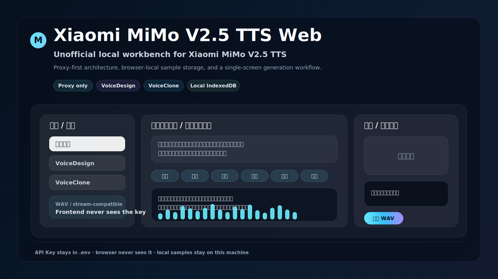

# Xiaomi MiMo V2.5 TTS Web

<p align="center">
  
</p>

<p align="center">
  
  
  
  
</p>

> Unofficial local workbench for Xiaomi MiMo V2.5 TTS. 浏览器负责编排、预览和样本管理，Express 只负责代理与请求拼装，API Key 只保留在本地 `.env` 中，不进入前端。

## 项目定位

这是一个面向 Xiaomi MiMo V2.5 TTS 的本地工作台，适合语音原型、样本管理和内部演示，覆盖三类常见场景：

- 内置音色合成
- 文本驱动的 VoiceDesign
- 样本驱动的 VoiceClone

## 主要能力

- 三种模式切换：`builtin`、`design`、`clone`
- Xiaomi MiMo V2.5 TTS 的统一入口，适合快速展示和传播
- 自然语言控制会自动组合场景、情绪、音色、语速和导演模板
- 音频标签控制会自动拼装开头标签和插入式标签
- VoiceClone 支持上传样本和现场录音，录音后会转为 WAV 保存
- 上传样本和录音会保存在浏览器本地 IndexedDB，方便复用
- 流式兼容模式按 MiMo 文档发送 `stream=true` 和 `pcm16`
- 生成结果可直接下载为 WAV

## 界面预览

上方封面图把 Xiaomi MiMo 放在第一视觉层级，同时展示了当前工作台的整体结构：左侧配置，中间编辑，生成与结果在同一流程里完成，便于从编排到预览一口气完成。

## 快速开始

1. 复制环境变量模板

   ```powershell
   Copy-Item .env.example .env
   ```

2. 安装依赖并启动

   ```powershell
   npm install
   npm run dev
   ```

3. 打开本地地址

   - 前端：`http://localhost:5173`
   - 后端代理：`http://localhost:3001`

## 配置

`.env` 只保留在本机，`.env.example` 才会进入仓库。

```env
MIMO_API_KEY=your_api_key_here
MIMO_BASE_URL=https://token-plan-cn.xiaomimimo.com/v1
PORT=3001
```

| 变量 | 说明 | 默认值 |
| --- | --- | --- |
| `MIMO_API_KEY` | MiMo 访问凭证，仅供本地代理使用 | 必填 |
| `MIMO_BASE_URL` | Xiaomi MiMo 接口地址。Token Plan 用上面的地址，普通按量 API 可切换到 `https://api.xiaomimimo.com/v1` | `https://token-plan-cn.xiaomimimo.com/v1` |
| `PORT` | 本地 Express 代理端口 | `3001` |

## 工作流

1. 选择模式和输出方式
2. 组合场景、情绪、音色和语速
3. 在 VoiceClone 中上传样本或录制参考音频
4. 填写合成文本并生成
5. 直接试听或下载 WAV

## 安全模型

- API Key 只读取本地 `.env`
- 前端不直接请求 MiMo API
- `.env` 已被 `.gitignore` 忽略，不会上传到 GitHub
- 语音样本只保存在浏览器本地，不会自动写入仓库

## 测试

```powershell
npm test
```

## 构建

```powershell
npm run build
```

## VoiceClone 说明

官方 MiMo-V2.5-TTS VoiceClone 文档当前展示的是每次在 `audio.voice` 中传入 `data:{MIME_TYPE};base64,$BASE64_AUDIO`，没有公开可复用的音色种子、voice id 或 voice token 参数。

因此本项目的复用方式是把录音和上传样本保存在浏览器本地，下次选择时继续随请求上传同一段音频样本。这样可以减少重复录制和重新选择文件，但不会变成服务端音色 ID。
